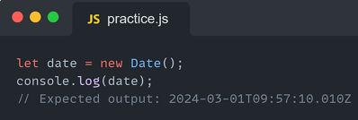
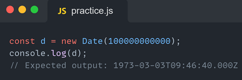
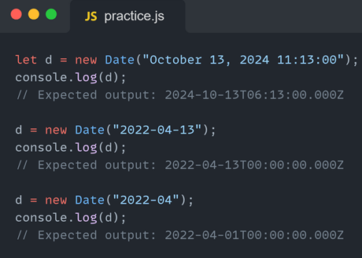
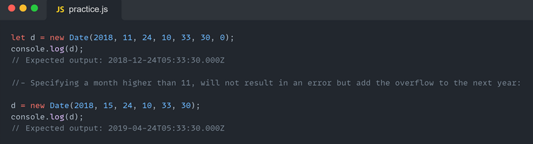
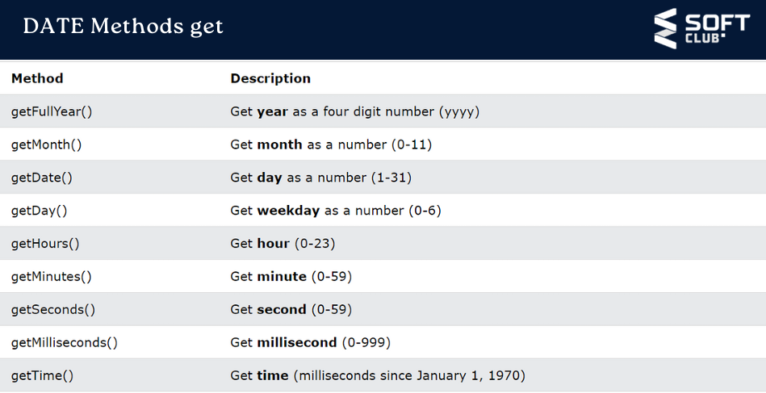
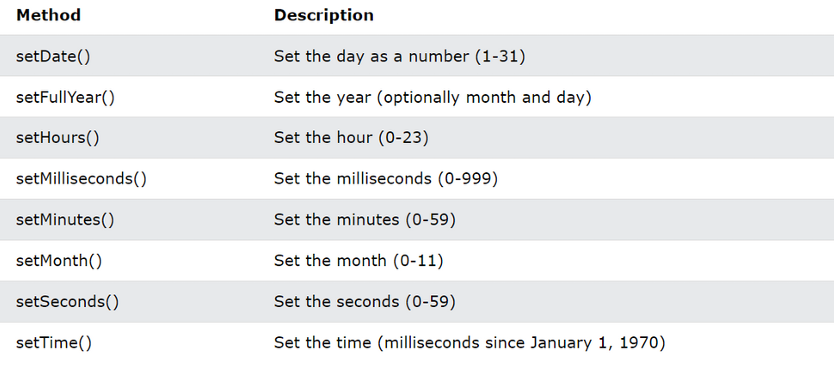

# ДАТА И ВРЕМЯ СОЗДАНИЯ

### Дата JavaScript по сути определяется как время в миллисекундах, прошедшее с начала эпохи, которая определяется как полночь в начале января 1, 1970, UTC (эквивалентно эпохе UNIX). Эта временная метка не зависит от часового пояса иуникально определяет момент в истории.
### Конструктор Date() создает объекты Date. При вызове в качестве функции он возвращает строку, представляющую текущее время.
## Создание объектов даты:
### Существует четыре способа создания объекта даты.
### new Date();
### new Date(миллисекунды)
### new Date (строка даты)
### new Date(год, месяц, день, часы,минуты,секунды,миллисекунды)
### new Date() — создает объект даты с текущей датой и временем:

### JavaScript хранит даты как количество миллисекунд с 01 января 1970 года. Нулевое время — 01 января 1970 года 00:00:00 UTC. Один день (24 часа) составляет 86 400 000 миллисекунд.
### new Date(milliseconds) создает новый объект даты как миллисекунды плюс нулевое время:

## new Date(string) — создает объект даты из строки даты:

### new Date(год,месяц,день,час,минута,секунда,миллисекунда) — создает объект даты с указанной датой и временем. 7 цифр указывают год, месяц, день, час, минуту, секунду и миллисекунду (в указанном порядке):JavaScript считает месяцы от 0 до 11: 
### Январь = 0.
### Декабрь = 11.

### Методы Set Date позволяют вам устанавливать значения даты (годы, месяцы, дни, часы, минуты, секунды, миллисекунды) для объекта Date.

### Метод getTime() возвращает количество миллисекунд с 1 января 1970 года.
### Date.now() возвращает количество миллисекунд, прошедших с 1 января 1970 года. Date.now() — это статический метод объекта Date. Вы не можете использовать его для объекта даты, например myDate.now(). Синтаксис всегда Date.now().
### Метод getDate() возвращает день даты в виде числа (1-31):
### Метод getDay() возвращает день недели даты в виде числа (0-6). В JavaScript первым днем недели (день 0) является воскресенье.
### Метод getFullYear() возвращает год даты в виде четырехзначного числа:
### Метод getMonth() возвращает месяц даты в виде числа (0-11). В JavaScript январь — это месяц с номером 0, февраль — это номер 1, ... Наконец, декабрь — это месяц с номером 11.
### Методы дат: getHours,getMinutes Метод getHours() возвращает часы даты в виде числа (0-23):
### Метод getMinutes() возвращает минуты даты в виде числа (0-59):
### Метод setFullYear() устанавливает год объекта даты. Метод setFullYear() может дополнительно установить месяц и день:
### Метод setMonth() устанавливает месяц объекта даты (0-11): Его также можно использовать для установки дня месяца